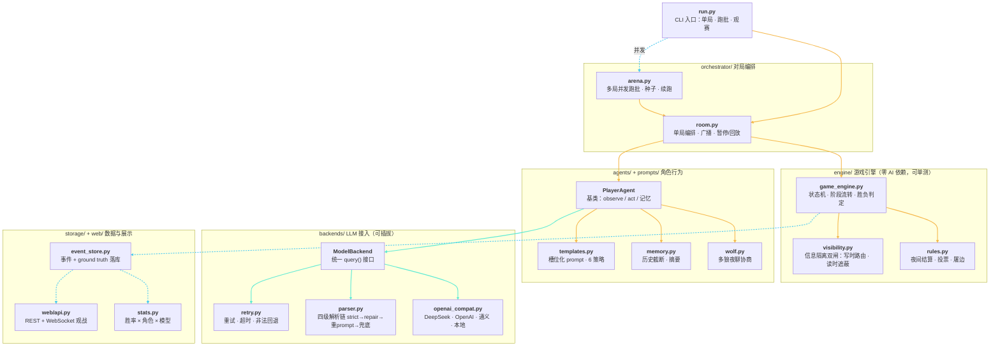

# 实现架构总览

狼人杀 Agent 竞技场 —— 落地实现架构。设计依据见 [deep-dive-notes.md](deep-dive-notes.md)，设计文档见 [specs/2025-08-11-architecture-mermaid-design.md](superpowers/specs/2025-08-11-architecture-mermaid-design.md)。

## 实现架构总览（渲染图）

## 图例

| 颜色 | 含义 | 示例 |
|---|---|---|
| 🟠 琥珀 | 控制流（调度 / 校验） | `room.py → game_engine.py` |
| 🔵 青蓝 | 数据流（状态 / 事件） | `game_engine.py → event_store.py` |
| 🟢 绿色 | LLM 调用 | `PlayerAgent → ModelBackend` |

## 关键设计决策

1. **引擎与 AI 解耦**：`engine/` 不依赖任何 LLM 代码，可独立单测、可复现（同 seed）。
2. **信息隔离双闸**：写时按角色路由投递，读时按可见性遮蔽 `[REDACTED]`，事件全量落库审计。
3. **四级解析链**：LLM 输出 strict JSON → 自动修复 → 重 prompt → 规则兜底，杜绝静默失败。
4. **可插拔后端**：所有模型走统一 `query()` 接口，`base_url` 切换 DeepSeek / OpenAI / 通义 / 本地。
